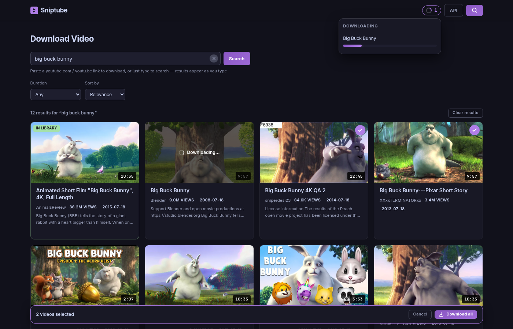
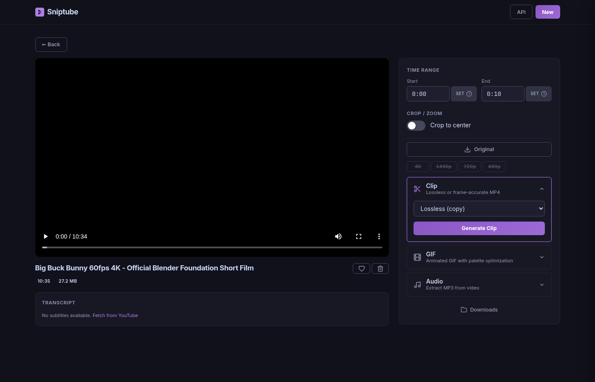
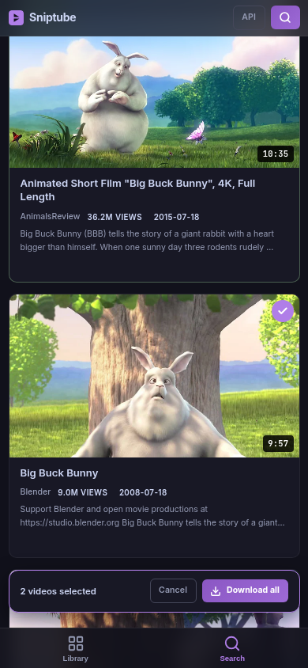

# Sniptube

Self-hosted YouTube clip and GIF generator. Download a video once with yt-dlp, then create lossless MP4 clips, high-quality GIFs, and MP3 extracts on demand via HTTP API, MCP tools, or a built-in web UI. Installable as a PWA for a native app experience.


*Live search-as-you-type: filters, in-place downloads with a background-downloads indicator, bulk selection with "Download all", and library cross-referencing.*

<table>
  <tr>
    <td width="62%"></td>
    <td width="38%"></td>
  </tr>
  <tr>
    <td align="center"><em>Per-video workspace: player, transcript, clip/GIF/audio, resolution downloads</em></td>
    <td align="center"><em>Mobile PWA: bottom tab bar, bulk download bar, share target</em></td>
  </tr>
</table>

## Quick Start

```bash
git clone https://github.com/lperez37/sniptube.git && cd sniptube
docker compose up -d
```

The UI is available at **http://localhost:8030**.

> ⚠️ **Security: Sniptube has no built-in authentication.** Anyone who can reach port 8030 can download videos to your disk, delete your library, and use your server as a YouTube proxy. Run it on a private network only (LAN, Tailscale, WireGuard), or put an authenticating proxy in front of it (Cloudflare Access, Authelia, basic auth in Caddy/nginx). Do not port-forward it to the internet as-is.

## How It Works

```
         ┌─────────────┐
  user ──> Web UI :8030 ├──┐
         └─────────────┘  │    ┌────────┐     ┌────────────┐
                          ├───>│ FastAPI │────>│   Redis    │
         ┌─────────────┐  │    │  API   │     │ (job queue)│
  curl ──> :8030/videos ├──┘    └───┬────┘     └─────┬──────┘
         └─────────────┘        │                │
                            SQLite            arq worker
                          (metadata)       (yt-dlp + ffmpeg)
                                               │
                                          /data/videos/
```

1. **POST a YouTube URL** — yt-dlp downloads the video (best mp4 up to 1080p) and fetches subtitles in the video's original language. Downloads use Android plus web YouTube clients so playable videos that hide streams from yt-dlp's default client still work.
2. **Request a clip or GIF** — specify start/end times and options. A background job runs ffmpeg.
3. **Poll the job** or let the UI auto-poll — when done, download the result.
4. **Caching** — identical requests are served from cache instantly (deterministic file hashing).

## API Reference

Base URL: `http://localhost:8030`

### Search YouTube

```bash
curl "http://localhost:8030/search?q=rick+astley&max_results=5"
```

Channel listing (browse a channel's videos):
```bash
curl "http://localhost:8030/search?q=@RickAstleyYT&max_results=10"
```

With filters:
```bash
curl "http://localhost:8030/search?q=cooking&duration=short&sort_by=views"
```

| Parameter | Type | Default | Description |
|-----------|------|---------|-------------|
| `q` | string | required | Search query (1-200 chars) or `@channel` handle |
| `max_results` | int | `12` | Results per page (1-30) |
| `page` | int | `1` | Page number (1-5). Raw results are cached for 5 minutes per query so page slices stay consistent. |
| `duration` | string | `"any"` | `"any"`, `"short"` (<4m), `"medium"` (4-20m), `"long"` (>20m) |
| `sort_by` | string | `"relevance"` | `"relevance"`, `"date"`, `"views"` (`date` is only meaningful for `@channel` queries) |

Response:
```json
{
  "query": "rick astley",
  "results": [
    {
      "youtube_id": "dQw4w9WgXcQ",
      "url": "https://www.youtube.com/watch?v=dQw4w9WgXcQ",
      "title": "Rick Astley - Never Gonna Give You Up",
      "duration": 212,
      "thumbnail_url": "...",
      "uploader": "Rick Astley",
      "view_count": 1500000000,
      "upload_date": "20091025",
      "description": "The official video for...",
      "already_downloaded": false,
      "video_id": null
    }
  ],
  "total_fetched": 5,
  "filters_applied": {}
}
```

Results are cross-referenced with the local library — `already_downloaded` is `true` and `video_id` is set for videos already in Sniptube.

### Download a Video

```bash
curl -X POST http://localhost:8030/videos \
  -H "Content-Type: application/json" \
  -d '{"url": "https://www.youtube.com/watch?v=VIDEO_ID"}'
```

Response:
```json
{"video_id": "a1b2c3d4e5f6", "job_id": "uuid", "status": "queued"}
```

If the video was already downloaded:
```json
{"video_id": "a1b2c3d4e5f6", "job_id": "", "status": "already_exists"}
```

### List Videos

```bash
curl http://localhost:8030/videos
```

Returns an array of video objects with `id`, `title`, `duration`, `language`, `subtitles`, `status`, `thumbnail_url`.

### Get Video Details

```bash
curl http://localhost:8030/videos/{videoId}
```

### Toggle Video Protection

```bash
curl -X PATCH http://localhost:8030/videos/{videoId}/protected \
  -H "Content-Type: application/json" \
  -d '{"protected": true}'
```

Protected videos are never deleted by auto-pruning or manual prune. Toggle off with `{"protected": false}`.

### Prune Old Videos

```bash
curl -X POST http://localhost:8030/videos/prune
```

Deletes all unprotected videos older than `TRIM_AFTER_DAYS` (default 14). Returns `{"deleted": N}`. Protected videos are always kept. A cron job also runs this automatically at 3 AM daily.

### Delete a Video

```bash
curl -X DELETE http://localhost:8030/videos/{videoId}
```

Removes the video, all derivatives, and database records.

### Create a Clip

```bash
curl -X POST http://localhost:8030/videos/{videoId}/clips \
  -H "Content-Type: application/json" \
  -d '{"start_sec": 10.0, "end_sec": 25.5, "mode": "copy"}'
```

| Parameter   | Type   | Default  | Description |
|-------------|--------|----------|-------------|
| `start_sec` | float  | required | Start time in seconds |
| `end_sec`   | float  | required | End time in seconds |
| `mode`      | string | `"copy"` | `"copy"` = lossless stream copy (instant, keyframe-aligned ~0.5s). `"precise"` = frame-accurate re-encode with `-crf 18` (slower, visually lossless). |
| `crop_pct`  | int    | `null`   | Crop to center N% of frame (10-100). Forces precise mode. |

### Create a GIF

```bash
curl -X POST http://localhost:8030/videos/{videoId}/gifs \
  -H "Content-Type: application/json" \
  -d '{"start_sec": 5.0, "end_sec": 10.0, "width": 480, "fps": 10, "quality": "high"}'
```

| Parameter | Type   | Default  | Description |
|-----------|--------|----------|-------------|
| `start_sec` | float | required | Start time in seconds |
| `end_sec`   | float | required | End time in seconds |
| `width`     | int   | `480`    | Output width in pixels (100-1920). Height scales proportionally. |
| `fps`       | int   | `10`     | Frames per second (1-30) |
| `quality`   | string | `"high"` | `"high"` = two-pass palette with Floyd-Steinberg dithering (best quality). `"fast"` = single-pass (smaller file). |
| `crop_pct`  | int    | `null`   | Crop to center N% of frame (10-100). |

### List Active Jobs

```bash
curl "http://localhost:8030/jobs/active?type=download"
```

Returns all currently queued/running jobs (optionally filtered by `type`). Used by the web UI to resume download progress tracking after a page reload.

### Poll Job Status

```bash
curl http://localhost:8030/jobs/{jobId}
```

Response:
```json
{
  "id": "uuid",
  "video_id": "a1b2c3d4e5f6",
  "type": "clip",
  "status": "completed",
  "progress": 100,
  "result_url": "/files/videos/a1b2c3d4e5f6/derivatives/clip/hash.mp4",
  "error": null
}
```

Status transitions: `queued` -> `running` (with progress 0-100) -> `completed` | `failed`

### Extract Audio (MP3)

```bash
# Full video
curl -X POST http://localhost:8030/videos/{videoId}/audio

# Time range
curl -X POST http://localhost:8030/videos/{videoId}/audio \
  -H "Content-Type: application/json" \
  -d '{"start_sec": 10.0, "end_sec": 30.0}'
```

| Parameter   | Type  | Default | Description |
|-------------|-------|---------|-------------|
| `start_sec` | float | `null`  | Start time in seconds (omit for full video) |
| `end_sec`   | float | `null`  | End time in seconds (omit for full video) |

Extracts audio as MP3 at 192 kbps. Provide both `start_sec` and `end_sec` for a time range, or omit both for the full video.

### Download at a Different Resolution

```bash
curl -X POST http://localhost:8030/videos/{videoId}/redownload \
  -H "Content-Type: application/json" \
  -d '{"height": 2160}'
```

| Parameter | Type | Default | Description |
|-----------|------|---------|-------------|
| `height`  | int  | required | Target vertical resolution (e.g. 2160 for 4K, 1440, 720, 480, 360) |

Downloads the native YouTube stream at the requested resolution via yt-dlp (no re-encoding). The source video is available via `/source`; use this for other resolutions. Results are cached by height. The same Android plus web YouTube client fallback used by initial downloads is applied here.

### Probe Available Resolutions

```bash
curl -X POST http://localhost:8030/videos/{videoId}/probe
```

Queries YouTube for available video resolutions without downloading. Returns `{"available_heights": [2160, 1440, 1080, 720, 480, 360, 240, 144]}`. Updates `meta.json` with the results. Useful for backfilling resolution data on videos downloaded before this feature existed.

### Fetch / Re-fetch Subtitles

```bash
curl -X POST http://localhost:8030/videos/{videoId}/subtitles/fetch
```

Fetches subtitles on demand using `youtube-transcript-api` (primary) with yt-dlp fallback. Useful when subtitles were unavailable during initial download (e.g. YouTube rate limiting). Won't overwrite existing subtitle files.

Response:
```json
{"languages": ["es", "en"], "fetched": ["es", "en"]}
```

### Get Subtitle Text (plain)

```bash
curl http://localhost:8030/videos/{videoId}/subtitles/{lang}/text
```

Returns subtitle content as plain text with VTT formatting stripped. Response is `text/plain`.

### Delete a Derivative

```bash
curl -X DELETE http://localhost:8030/videos/{videoId}/derivatives/{jobId}
```

Deletes a single derivative file (clip, GIF, audio, or redownloaded video) and its database record. Frees disk space — the derivative can be regenerated later by re-submitting the same request.

### List Derivatives

```bash
curl http://localhost:8030/videos/{videoId}/derivatives
```

Returns all clips and GIFs generated for a video, with download URLs.

### List Subtitles

```bash
curl http://localhost:8030/videos/{videoId}/subtitles
```

Returns available subtitle tracks:
```json
[{"language": "en", "url": "/files/videos/{videoId}/subs/en.vtt"}]
```

### Download Derivative (Friendly Filename)

```bash
curl -O -J http://localhost:8030/videos/{videoId}/derivatives/{jobId}/download
```

Returns the file with a human-readable filename based on the video title (e.g. `gpt-5-4-is-really-really-good-clip-aab86e.mp4`). MP3 audio for the full video uses just the video title (e.g. `video-title.mp3`).

### Download Files (Raw)

All generated files are also served at their raw paths:
```
http://localhost:8030/files/videos/{videoId}/derivatives/clip/{hash}.mp4
http://localhost:8030/files/videos/{videoId}/derivatives/gif/{hash}.gif
http://localhost:8030/files/videos/{videoId}/derivatives/audio/{hash}.mp3
http://localhost:8030/files/videos/{videoId}/derivatives/redownload/{hash}.mp4
http://localhost:8030/files/videos/{videoId}/subs/{lang}.vtt
```

## Web UI

Open **http://localhost:8030** in a browser. Responsive dark interface (Inter + JetBrains Mono) with purple accent, optimized for desktop, tablet, and mobile (480/768/1024px breakpoints). Installable as a PWA — the service worker caches the app shell for fast loads, while API calls always go to the network.

- **Client-side routing** — hash-based URLs (`#/video/{id}`, `#/download`) so refreshing the page preserves your location; browser back/forward works
- **Library page** — video cards with thumbnails, skeleton loading shimmer, duration badges, language/subtitle indicators, heart overlay on protected videos, Prune button in header to clean up old unprotected videos
- **Download page** — dual-purpose input: paste a YouTube URL (auto-submits) or just type — **search results appear as you type** (debounced, race-free). Type `@handle` to browse a channel's videos. Filters (duration, sort), skeleton loading states, inline empty/error states, and append-style "Load more" pagination served from a server-side cache. Result cards show thumbnails, view counts, upload dates, description snippets, and "In Library" badges; clicking a result downloads it **in place** (results stay visible so you can queue several), or opens the detail page if already downloaded. Clicking an uploader name lists their channel. Search state lives in the URL hash, so reload, back-navigation, and deep links restore the search.
- **Bulk downloads** — tick the checkmark on any number of search results and hit "Download all"; a bottom action bar (thumb-reachable bottom sheet on mobile) queues them all at once.
- **Mobile-first PWA** — bottom tab bar (Library / Search) on small screens with safe-area insets, and an Android **share target**: share a video from the YouTube app straight to Sniptube and it starts downloading immediately (shared text becomes a search). Requires the PWA to be installed.
- **Background downloads** — downloads keep running server-side no matter what the browser does. A header indicator shows active downloads with per-item progress, follows you across pages, and **survives page reloads** (the UI rehydrates from `GET /jobs/active`). Stale jobs orphaned by a server restart are swept to `failed` automatically on startup.
- **Video detail** — two-column layout: left column has HTML5 video player, title/metadata with heart (protect) button, and collapsible transcript panel (3-line clamp with "Show more"); right column has time range + crop controls, Original download button, resolution button grid (native YouTube streams at 4K/1440p/720p/480p/etc. via yt-dlp with "Detect" fallback for older videos; source resolution is filtered out since it's the Original button), accordion of action cards (Clip, GIF, Audio) with Lucide SVG icons, and a "Downloads" button that opens a slide-in panel (380px on desktop, bottom sheet on mobile) listing cached derivatives with per-item delete buttons
- **Friendly download filenames** — derivatives download with human-readable names based on the video title (e.g. `video-title-clip-aab86e.mp4`, `video-title.mp3`)
- **API docs** — nav bar includes an "API" link that opens the interactive Swagger UI at `/docs`
- **Toast notifications** — bottom-right slide-up toasts with download links on completed jobs (8s duration for actionable toasts, 4s for info)
- **Accessibility** — ARIA labels on interactive elements, focus-visible rings, screen-reader-only labels, semantic roles on toasts and modals

## Clip Modes Explained

| Mode | ffmpeg | Speed | Accuracy |
|------|--------|-------|----------|
| `copy` | `-c copy` (stream copy) | Instant | Keyframe-aligned (~0.5s tolerance) |
| `precise` | `-c:v libx264 -crf 18 -c:a copy` | Slower | Frame-accurate, visually lossless |

**`copy`** is the default. It copies the video and audio streams without re-encoding — zero quality loss and near-instant. The only trade-off is that cut points snap to the nearest keyframe.

**`precise`** re-encodes the video with CRF 18 (visually lossless, universally playable yuv420p) for frame-accurate cuts, using fast input seeking so only the clipped range is decoded. Audio is always copied without re-encoding.

## GIF Quality Explained

**`high`** (default) uses a two-pass pipeline:
1. Generate an optimized color palette from the specific segment
2. Render the GIF using that palette with Floyd-Steinberg dithering and Lanczos scaling

This produces GIFs that look great on any device — chat apps, docs, social media, presentations.

**`fast`** uses a single-pass render. Smaller files, faster generation, but lower color quality.

## Subtitles

Subtitles are fetched using **`youtube-transcript-api`** (primary) with yt-dlp as fallback:
- **Primary**: `youtube-transcript-api` — lightweight, no API key, structured segments, rarely rate-limited
- **Fallback**: yt-dlp subtitle download (if transcript API fails)
- Prefers manually uploaded subtitles over auto-generated ones
- Fetches the video's original language + English (if different)
- Supports translation via YouTube's translation interface
- Stored as WebVTT (`.vtt`) — the web-native subtitle format
- Subtitle fetch failures are non-fatal during download
- Can be re-fetched on demand via `POST /videos/{videoId}/subtitles/fetch`
- Plain text transcript available via `GET /videos/{videoId}/subtitles/{lang}/text` (used by UI clipboard copy)
- UI provides: copy transcript to clipboard (per language)

## Architecture

### Services (Docker Compose)

| Service | Image | Role |
|---------|-------|------|
| `api` | Custom (Python 3.12 + ffmpeg) | FastAPI server on port 8030 |
| `worker` | Same image, different entrypoint | arq worker processing jobs |
| `redis` | redis:7-alpine | Job queue backend |

### Data Layout

```
/data/
  video-clips.db                    # SQLite database
  videos/
    <videoId>/                       # e.g. 7318dd2eaaf6
      source.mp4                     # Original download
      meta.json                      # yt-dlp metadata
      subs/
        en.vtt                       # Subtitles by language
        es.vtt
      derivatives/
        clip/<paramsHash>.mp4        # Cached clips
        gif/<paramsHash>.gif         # Cached GIFs
        audio/<paramsHash>.mp3       # Cached audio extractions
        redownload/<paramsHash>.mp4  # Cached resolution re-downloads
```

### ID Schemes

- **videoId** — SHA-256 of the YouTube video ID, truncated to 12 hex chars. Deterministic: same URL always produces the same ID.
- **jobId** — UUID4, unique per request.
- **paramsHash** — SHA-256 of sorted parameters, truncated to 10 hex chars. Enables derivative caching.

### Safety

- **SSRF prevention** — only `youtube.com` and `youtu.be` domains accepted
- **No shell injection** — ffmpeg commands built as argument lists, never shell strings
- **No user input in paths** — all filenames are hashed IDs
- **Queue concurrency** — max 2 parallel jobs to prevent CPU saturation
- **Auto-trim** — daily cron (3 AM) deletes unprotected videos older than `TRIM_AFTER_DAYS`; manual prune via UI or API
- **Idempotent downloads** — re-posting the same URL returns the existing video

## MCP Server

For use with Claude Code or any MCP-compatible client:

```bash
python mcp/server.py http://localhost:8030
```

Tools:
| Tool | Parameters | Returns |
|------|-----------|---------|
| `youtube_search` | `query, max_results?, duration?, sort_by?` | `{query, results[], total_fetched}` |
| `video_download` | `url` | `{video_id, job_id}` |
| `video_list` | — | `[{id, title, duration}]` |
| `video_info` | `video_id` | metadata |
| `video_clip` | `video_id, start_sec, end_sec, mode?` | `{job_id}` |
| `video_gif` | `video_id, start_sec, end_sec, width?, fps?, quality?` | `{job_id}` |
| `video_audio` | `video_id, start_sec?, end_sec?` | `{job_id}` |
| `job_status` | `job_id` | `{status, progress, result_url}` |

## Configuration

Environment variables (set in docker-compose.yml):

| Variable | Default | Description |
|----------|---------|-------------|
| `REDIS_URL` | `redis://redis:6379` | Redis connection URL |
| `DATA_DIR` | `/data` | Persistent storage path |
| `DOWNLOAD_MAX_HEIGHT` | `1080` | Max video resolution |
| `TRIM_AFTER_DAYS` | `14` | Auto-prune videos older than N days |
| `WORKER_CONCURRENCY` | `2` | Max parallel jobs |
| `GIF_DEFAULT_WIDTH` | `480` | Default GIF width |
| `GIF_DEFAULT_FPS` | `10` | Default GIF frame rate |

## Deployment

```bash
git clone https://github.com/lperez37/sniptube.git && cd sniptube
docker compose up -d

# Verify
curl http://localhost:8030/videos
```

Port mapping: host `8030` -> container `8000`. The API/worker containers run as a non-root user (uid 1000); make sure `./data` is writable by uid 1000 (`chown -R 1000:1000 data` if needed).

Instance-specific additions (reverse proxies, tunnels) belong in `docker-compose.override.yml`, which Docker Compose merges automatically and this repo gitignores.

## Tests

```bash
cd api && python3 -m venv .venv && .venv/bin/pip install -e . --group dev
.venv/bin/python -m pytest tests -q
```

## License

[MIT](LICENSE)
